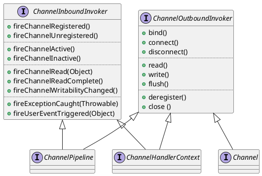

```plantuml
@startuml

interface ChannelInboundInvoker {
    + fireChannelRegistered()
    + fireChannelUnregistered()
    ..
    + fireChannelActive()
    + fireChannelInactive()
    ..
    + fireChannelRead(Object)
    + fireChannelReadComplete()
    + fireChannelWritabilityChanged()
    ..
    + fireExceptionCaught(Throwable)
    + fireUserEventTriggered(Object)
}

interface ChannelOutboundInvoker {
    + bind()
    + connect()
    + disconnect()
    ..
    + read()
    + write()
    + flush()
    ..
    + deregister()
    + close ()
}

interface ChannelHandlerContext
interface ChannelPipeline
interface Channel

ChannelHandlerContext -up-|> ChannelInboundInvoker
ChannelPipeline -up-|> ChannelInboundInvoker

ChannelHandlerContext -up-|> ChannelOutboundInvoker
ChannelPipeline -up-|> ChannelOutboundInvoker
Channel -up-|> ChannelOutboundInvoker

@enduml
```
