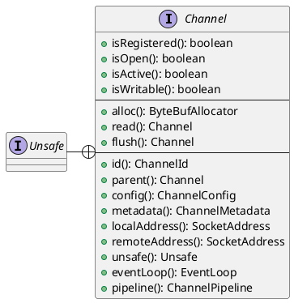

```plantuml
@startuml

interface Channel {
    + isRegistered(): boolean
    + isOpen(): boolean
    + isActive(): boolean
    + isWritable(): boolean
    --
    + alloc(): ByteBufAllocator
    + read(): Channel
    + flush(): Channel
    --
    + id(): ChannelId
    + parent(): Channel
    + config(): ChannelConfig
    + metadata(): ChannelMetadata
    + localAddress(): SocketAddress
    + remoteAddress(): SocketAddress
    + unsafe(): Unsafe
    + eventLoop(): EventLoop
    + pipeline(): ChannelPipeline
}

interface Unsafe

Unsafe -right-+ Channel

@enduml
```
