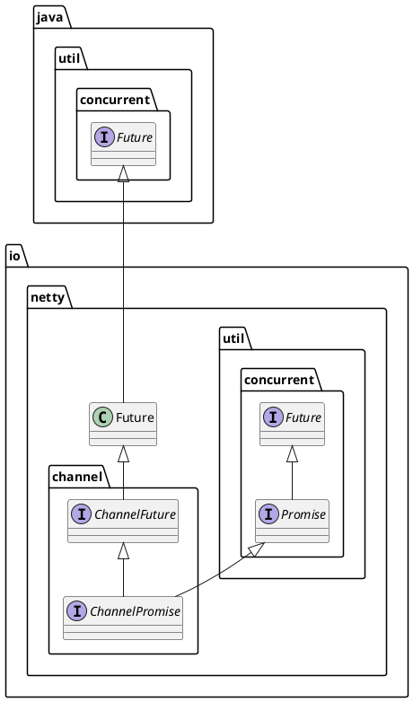

```plantuml
@startuml

namespace java.util.concurrent {
    interface Future
}

package io.netty {
    package util.concurrent {
        interface Promise
        interface Future

        Promise -up-|> Future
    }

    package channel {
        interface ChannelPromise
        interface ChannelFuture

        ChannelPromise -up-|> ChannelFuture
    }

    ChannelPromise -up-|> Promise
    ChannelFuture -up-|> Future

    Future  -up-|> java.util.concurrent.Future
}

@enduml
```
