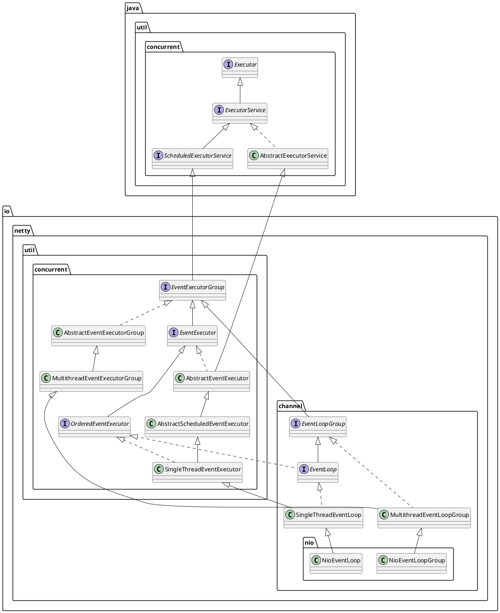

```plantuml
@startuml

package java.util.concurrent {
    interface ScheduledExecutorService
    interface ExecutorService
    interface Executor

    ScheduledExecutorService -up-|> ExecutorService
    ExecutorService -up-|> Executor

    AbstractExecutorService .up.|> ExecutorService
}

package io.netty.util.concurrent {
    interface OrderedEventExecutor
    interface EventExecutor
    interface EventExecutorGroup

    OrderedEventExecutor -up-|> EventExecutor
    EventExecutor -up-|> EventExecutorGroup
    MultithreadEventExecutorGroup -up-|> AbstractEventExecutorGroup
    AbstractEventExecutorGroup .up.|> EventExecutorGroup
    EventExecutorGroup -up-|> ScheduledExecutorService
}

' SingleThread
package io.netty.util.concurrent {
    SingleThreadEventExecutor .up.|> OrderedEventExecutor
    SingleThreadEventExecutor -up-|> AbstractScheduledEventExecutor
    AbstractScheduledEventExecutor -up-|> AbstractEventExecutor
    AbstractEventExecutor -up-|> AbstractExecutorService
    AbstractEventExecutor .up.|> EventExecutor
}

package io.netty.channel {
    interface EventLoop
    interface EventLoopGroup

    EventLoop -up-|> EventLoopGroup
    EventLoop .up.|> OrderedEventExecutor
    EventLoopGroup -up-|> EventExecutorGroup

    MultithreadEventLoopGroup .up.|> EventLoopGroup
    MultithreadEventLoopGroup -up-|> MultithreadEventExecutorGroup

    SingleThreadEventLoop .up.|> EventLoop
    SingleThreadEventLoop -up-|> SingleThreadEventExecutor
}

package io.netty.channel.nio {
    NioEventLoopGroup -up-|> MultithreadEventLoopGroup
    NioEventLoop -up-|> SingleThreadEventLoop
}

@enduml
```
