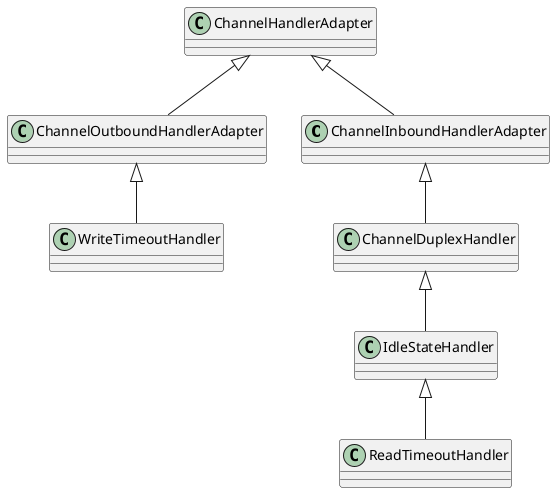
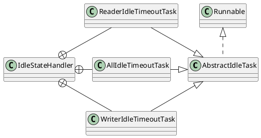

```plantuml
@startuml

ChannelInboundHandlerAdapter -up-|> ChannelHandlerAdapter
ChannelDuplexHandler -up-|> ChannelInboundHandlerAdapter
IdleStateHandler -up-|> ChannelDuplexHandler
ReadTimeoutHandler -up-|> IdleStateHandler

ChannelOutboundHandlerAdapter -up-|> ChannelHandlerAdapter
WriteTimeoutHandler -up-|> ChannelOutboundHandlerAdapter

@enduml
```

---

```plantuml
@startuml

AbstractIdleTask .up.|> Runnable

class AllIdleTimeoutTask
class ReaderIdleTimeoutTask
class WriterIdleTimeoutTask

ReaderIdleTimeoutTask -[hidden]- AllIdleTimeoutTask
AllIdleTimeoutTask -[hidden]- WriterIdleTimeoutTask

AllIdleTimeoutTask -right-|> AbstractIdleTask
ReaderIdleTimeoutTask -[norank]-|> AbstractIdleTask
WriterIdleTimeoutTask -[norank]-|> AbstractIdleTask

IdleStateHandler +-right- AllIdleTimeoutTask
IdleStateHandler +-[norank]- ReaderIdleTimeoutTask
IdleStateHandler +-[norank]- WriterIdleTimeoutTask

@enduml
```
