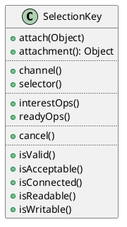

```plantuml
@startuml

class SelectionKey {
    + attach(Object)
    + attachment(): Object
    ..
    + channel()
    + selector()
    ..
    + interestOps()
    + readyOps()
    ..
    + cancel()
    ..
    + isValid()
    + isAcceptable()
    + isConnected()
    + isReadable()
    + isWritable()
}

@enduml
```
