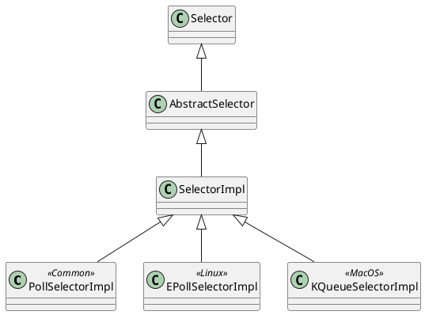

```plantuml
@startuml

class PollSelectorImpl <<Common>> {

}

class EPollSelectorImpl <<Linux>> {

}

class KQueueSelectorImpl <<MacOS>> {

}

AbstractSelector -up-|> Selector
SelectorImpl -up-|> AbstractSelector
PollSelectorImpl -up-|> SelectorImpl
EPollSelectorImpl -up-|> SelectorImpl
KQueueSelectorImpl -up-|> SelectorImpl

@enduml
```
