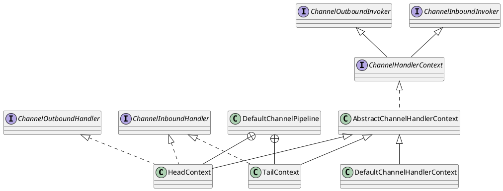

```puml
@startuml

HeadContext -up-+ DefaultChannelPipeline
TailContext -up-+ DefaultChannelPipeline

interface ChannelInboundHandler
interface ChannelOutboundHandler

HeadContext -up-|> AbstractChannelHandlerContext
HeadContext .up.|> ChannelInboundHandler
HeadContext .up.|> ChannelOutboundHandler

TailContext -up-|> AbstractChannelHandlerContext
TailContext .up.|> ChannelInboundHandler

DefaultChannelHandlerContext -up-|> AbstractChannelHandlerContext

interface ChannelHandlerContext
interface ChannelInboundInvoker
interface ChannelOutboundInvoker

AbstractChannelHandlerContext .up.|> ChannelHandlerContext
ChannelHandlerContext -up-|> ChannelInboundInvoker
ChannelHandlerContext -up-|> ChannelOutboundInvoker

@enduml
```
