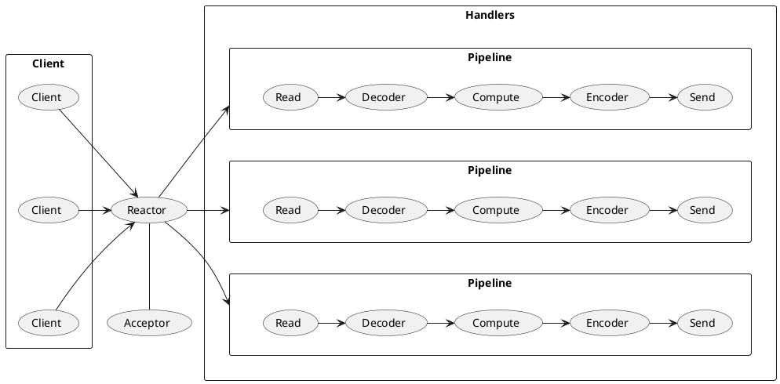

```plantuml
@startuml

(Reactor) -- (Acceptor)

rectangle Client {
    (Client) as Client1
    (Client) as Client2
    (Client) as Client3

    Client1 -[hidden]-Client2
    Client2 -[hidden]-Client3
}

Client1 -down-> Reactor
Client2 -right-> Reactor
Client3 -up-> Reactor

rectangle Handlers {

    rectangle Pipeline as Pipeline1 {
        (Read) as Read1
        (Decoder) as Decoder1
        (Compute) as Compute1
        (Encoder) as Encoder1
        (Send) as Send1

        (Read1) -> (Decoder1)
        (Decoder1) -> (Compute1)
        (Compute1) -> (Encoder1)
        (Encoder1) -> (Send1)
    }

    rectangle Pipeline as Pipeline2 {
        (Read) as Read2
        (Decoder) as Decoder2
        (Compute) as Compute2
        (Encoder) as Encoder2
        (Send) as Send2

        (Read2) -> (Decoder2)
        (Decoder2) -> (Compute2)
        (Compute2) -> (Encoder2)
        (Encoder2) -> (Send2)
    }

    rectangle Pipeline as Pipeline3 {
        (Read) as Read3
        (Decoder) as Decoder3
        (Compute) as Compute3
        (Encoder) as Encoder3
        (Send) as Send3

        (Read3) -> (Decoder3)
        (Decoder3) -> (Compute3)
        (Compute3) -> (Encoder3)
        (Encoder3) -> (Send3)
    }

}

Pipeline1 -[hidden]- Pipeline2
Pipeline2 -[hidden]- Pipeline3

Reactor -up-> Pipeline1
Reactor -right-> Pipeline2
Reactor -down-> Pipeline3

@enduml
```
