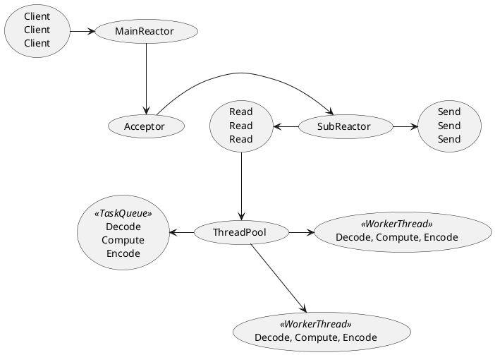

```plantuml
@startuml

(Client\nClient\nClient) as Client

(Client) -right-> (MainReactor)
(MainReactor) --> (Acceptor)
(Acceptor) -> (SubReactor)

(Read\nRead\nRead) as Read

(Send\nSend\nSend) as Send

Read <- SubReactor
SubReactor -> Send

(Decode\nCompute\nEncode) as TaskQueue <<TaskQueue>>

(Decode, Compute, Encode) as WorkerThread1 <<WorkerThread>>
(Decode, Compute, Encode) as WorkerThread2 <<WorkerThread>>
WorkerThread1 -[hidden]- WorkerThread2

Read --> (ThreadPool)

TaskQueue <- ThreadPool
ThreadPool -> WorkerThread1
ThreadPool -> WorkerThread2

@enduml
```
