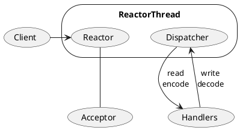

```puml
@startuml

storage ReactorThread {
    (Reactor)
    (Dispatcher)
}

(Client) -> Reactor
Reactor -- (Acceptor)

(Dispatcher) --> (Handlers): read\nencode
(Dispatcher) <-- (Handlers): write\ndecode

@enduml
```
