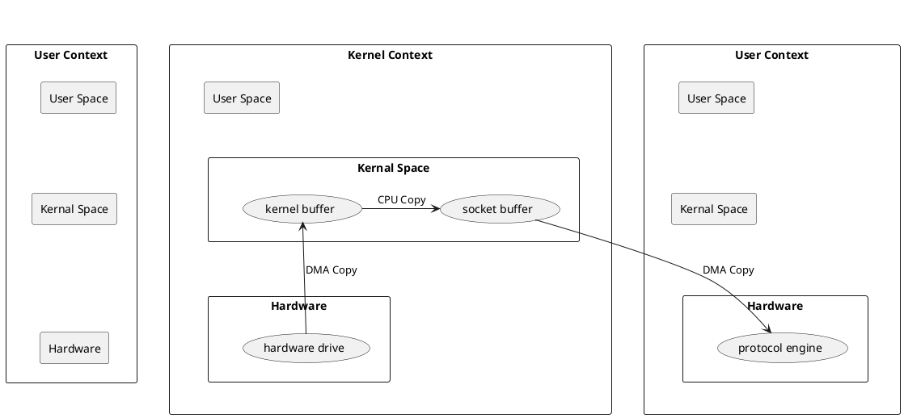

```plantuml
@startuml

rectangle "User Context" as uc1 {
    rectangle "User Space" as uc1us {
    }
    rectangle "Kernal Space" as uc1ks {
        
    }
    rectangle "Hardware" as uc1hd {
        
    }

    uc1us -[hidden]- uc1ks
    uc1ks -[hidden]- uc1hd
}

rectangle "Kernel Context" as kc1 {
    rectangle "User Space" as kc1us {
    }
    rectangle "Kernal Space" as kc1ks {
        (kernel buffer) as kb
        (socket buffer) as sb
    }
    rectangle "Hardware" as kc1hd {
        (hardware drive) as hd
    }

    kc1us -[hidden]- kc1ks
    kc1ks -[hidden]- kc1hd
}

rectangle "User Context" as uc2 {
    rectangle "User Space" as uc2us {
    }
    rectangle "Kernal Space" as uc2ks {
    }
    rectangle "Hardware" as uc2hd {
        (protocol engine) as pe
    }
    uc2us -[hidden]- uc2ks
    uc2ks -[hidden]- uc2hd

    'hide uc2ks
}

uc1 -[hidden] kc1
kc1 -[hidden] uc2

hd -[norank]-> kb: DMA Copy
kb -right-> sb: CPU Copy
sb -[norank]-> pe: DMA Copy

@enduml
```

---

* do copy: 3 times
* switch context: 2 times

---

* since Linux kernel 2.1
* skip User Context

---
