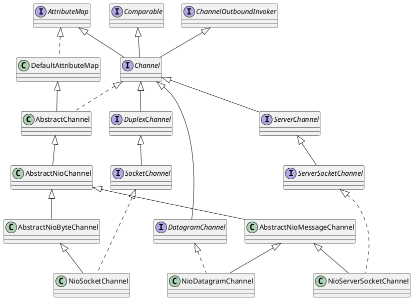

```puml
@startuml

AbstractChannel -up-|> DefaultAttributeMap
AbstractNioChannel -up-|> AbstractChannel
AbstractNioMessageChannel -up-|> AbstractNioChannel
NioServerSocketChannel -up-|> AbstractNioMessageChannel

interface ServerSocketChannel
interface ServerChannel
interface Channel

NioServerSocketChannel .up.|> ServerSocketChannel
ServerSocketChannel -up-|> ServerChannel
ServerChannel -up-|> Channel

interface AttributeMap
interface ChannelOutboundInvoker
interface Comparable

Channel -up-|> AttributeMap
Channel -up-|> ChannelOutboundInvoker
Channel -up-|> Comparable

NioSocketChannel -up-|> AbstractNioByteChannel
AbstractNioByteChannel -up-|> AbstractNioChannel

interface SocketChannel
interface DuplexChannel

NioSocketChannel .up.|> SocketChannel
SocketChannel -up-|> DuplexChannel
DuplexChannel -up-|> Channel

DefaultAttributeMap .up.|> AttributeMap
AbstractChannel .up.|> Channel

interface DatagramChannel

NioDatagramChannel -up-|> AbstractNioMessageChannel
NioDatagramChannel .up.|> DatagramChannel
DatagramChannel -up-|> Channel

@enduml
```
