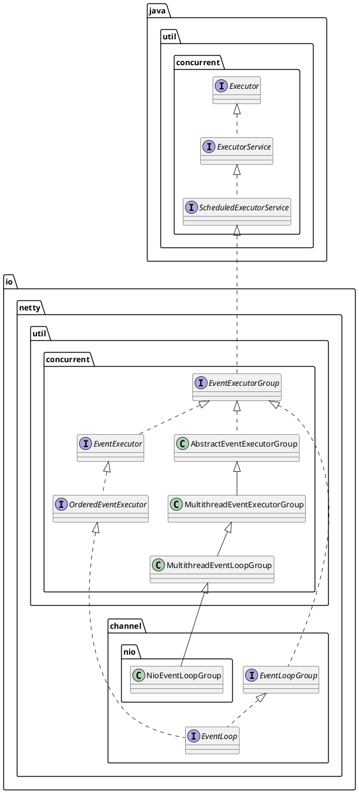

```puml
@startuml

interface io.netty.channel.EventLoop
interface io.netty.util.concurrent.OrderedEventExecutor
interface io.netty.channel.EventLoopGroup
interface io.netty.util.concurrent.EventExecutor
interface io.netty.util.concurrent.EventExecutorGroup
interface java.util.concurrent.ScheduledExecutorService
interface java.util.concurrent.ExecutorService
interface java.util.concurrent.Executor

io.netty.channel.EventLoop .up.|> io.netty.util.concurrent.OrderedEventExecutor
io.netty.channel.EventLoop .up.|> io.netty.channel.EventLoopGroup
io.netty.util.concurrent.OrderedEventExecutor .up.|> io.netty.util.concurrent.EventExecutor
io.netty.util.concurrent.EventExecutor .up.|> io.netty.util.concurrent.EventExecutorGroup
io.netty.channel.EventLoopGroup .up.|> io.netty.util.concurrent.EventExecutorGroup

io.netty.util.concurrent.EventExecutorGroup .up.|> java.util.concurrent.ScheduledExecutorService
java.util.concurrent.ScheduledExecutorService .up.|> java.util.concurrent.ExecutorService
java.util.concurrent.ExecutorService .up.|> java.util.concurrent.Executor

io.netty.channel.nio.NioEventLoopGroup -up-|> io.netty.util.concurrent.MultithreadEventLoopGroup
io.netty.util.concurrent.MultithreadEventLoopGroup -up-|> io.netty.util.concurrent.MultithreadEventExecutorGroup
io.netty.util.concurrent.MultithreadEventExecutorGroup -up-|> io.netty.util.concurrent.AbstractEventExecutorGroup

io.netty.util.concurrent.AbstractEventExecutorGroup .up.|> io.netty.util.concurrent.EventExecutorGroup

@enduml
```
