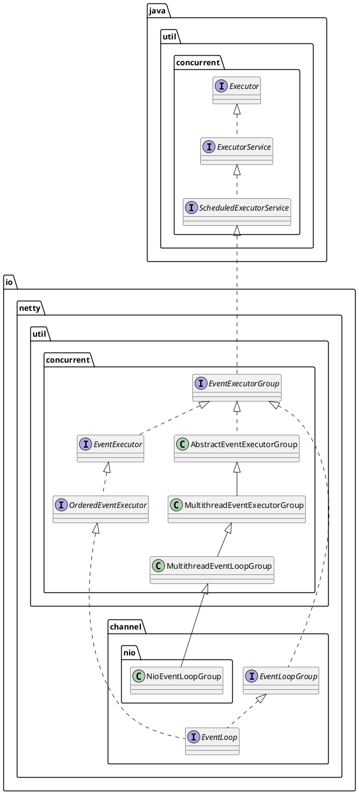

```puml
@startuml

package java.util.concurrent {
    interface ScheduledExecutorService
    interface ExecutorService
    interface Executor

    ScheduledExecutorService .up.|> ExecutorService
    ExecutorService .up.|> Executor
}

package io.netty.util.concurrent {
    interface OrderedEventExecutor
    interface EventExecutor
    interface EventExecutorGroup

    OrderedEventExecutor .up.|> EventExecutor
    EventExecutor .up.|> EventExecutorGroup
    MultithreadEventLoopGroup -up-|> MultithreadEventExecutorGroup
    MultithreadEventExecutorGroup -up-|> AbstractEventExecutorGroup
    AbstractEventExecutorGroup .up.|> EventExecutorGroup
    EventExecutorGroup .up.|> ScheduledExecutorService
}

package io.netty.channel {
    interface EventLoop
    interface EventLoopGroup

    EventLoop .up.|> EventLoopGroup
    EventLoop .up.|> OrderedEventExecutor
    EventLoopGroup .up.|> EventExecutorGroup

    package nio {
        NioEventLoopGroup -up-|> MultithreadEventLoopGroup
    }
}

@enduml
```
