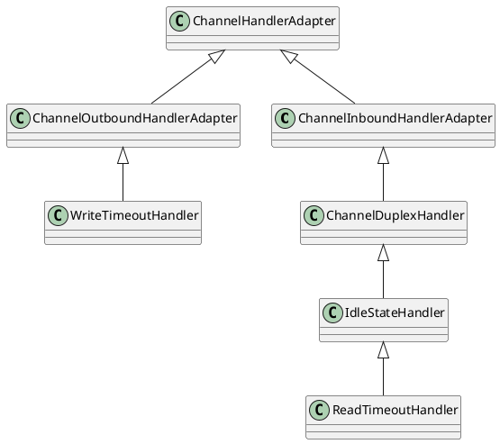

```puml
@startuml

ChannelInboundHandlerAdapter -up-|> ChannelHandlerAdapter
ChannelDuplexHandler -up-|> ChannelInboundHandlerAdapter
IdleStateHandler -up-|> ChannelDuplexHandler
ReadTimeoutHandler -up-|> IdleStateHandler

ChannelOutboundHandlerAdapter -up-|> ChannelHandlerAdapter
WriteTimeoutHandler -up-|> ChannelOutboundHandlerAdapter

@enduml
```

---
