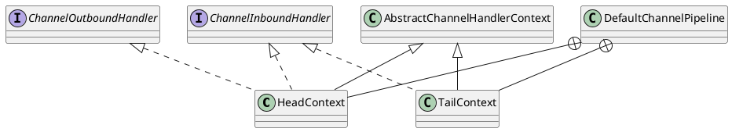

```puml
@startuml

HeadContext -up-+ DefaultChannelPipeline
TailContext -up-+ DefaultChannelPipeline

interface ChannelInboundHandler
interface ChannelOutboundHandler

HeadContext .up.|> ChannelInboundHandler
HeadContext .up.|> ChannelOutboundHandler
HeadContext -up-|> AbstractChannelHandlerContext

TailContext -up-|> AbstractChannelHandlerContext
TailContext .up.|> ChannelInboundHandler

@enduml
```
