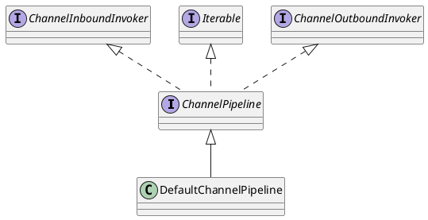

```puml
@startuml

interface ChannelPipeline
interface ChannelInboundInvoker
interface ChannelOutboundInvoker
interface Iterable

ChannelPipeline .up.|> ChannelOutboundInvoker
ChannelPipeline .up.|> Iterable
ChannelPipeline .up.|> ChannelInboundInvoker

DefaultChannelPipeline -up-|> ChannelPipeline

@enduml
```
