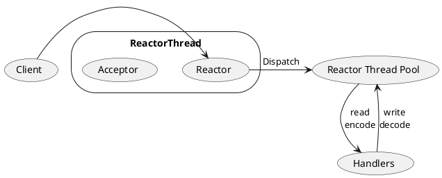

```puml
@startuml

storage ReactorThread {
    (Reactor)
    (Acceptor)
}

(Client) -> Reactor

Reactor -> (Reactor Thread Pool): Dispatch

(Reactor Thread Pool) --> (Handlers): read\nencode
(Handlers) --> (Reactor Thread Pool): write\ndecode

@enduml
```
