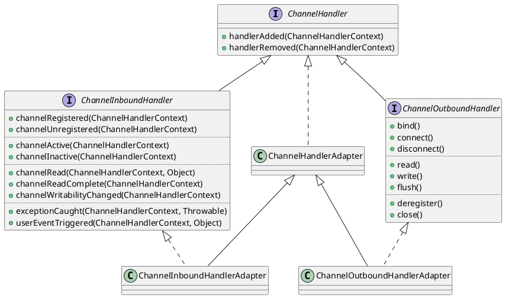

```puml
@startuml

interface ChannelHandler {
    + handlerAdded(ChannelHandlerContext)
    + handlerRemoved(ChannelHandlerContext)
}

interface ChannelInboundHandler {
    + channelRegistered(ChannelHandlerContext)
    + channelUnregistered(ChannelHandlerContext)
    ..
    + channelActive(ChannelHandlerContext)
    + channelInactive(ChannelHandlerContext)
    ..
    + channelRead(ChannelHandlerContext, Object)
    + channelReadComplete(ChannelHandlerContext)
    + channelWritabilityChanged(ChannelHandlerContext)
    ..
    + exceptionCaught(ChannelHandlerContext, Throwable)
    + userEventTriggered(ChannelHandlerContext, Object)
}

interface ChannelOutboundHandler {
    + bind()
    + connect()
    + disconnect()
    ..
    + read()
    + write()
    + flush()
    ..
    + deregister()
    + close()
}

ChannelHandlerAdapter .up.|> ChannelHandler
ChannelInboundHandler -up-|> ChannelHandler
ChannelOutboundHandler -up-|> ChannelHandler

ChannelInboundHandlerAdapter .up.|> ChannelInboundHandler
ChannelOutboundHandlerAdapter .up.|> ChannelOutboundHandler
ChannelInboundHandlerAdapter -up-|> ChannelHandlerAdapter
ChannelOutboundHandlerAdapter -up-|> ChannelHandlerAdapter

@enduml
```
