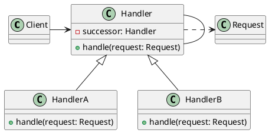

```plantuml
@startuml

class Client {

}

class Request {

}

class Handler {
    - successor: Handler    
    + handle(request: Request)
}

class HandlerA {
    + handle(request: Request)
}

class HandlerB {
    + handle(request: Request)
}

Client -> Handler
Handler - Handler
Handler .> Request
Handler <|-- HandlerA
Handler <|-- HandlerB

@enduml
```

## Examples

* java.lang.ClassLoader
* DNS server - domain resolve

---
