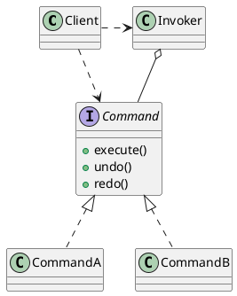

```puml
@startuml

class Client {

}

class Invoker {

}

interface Command {
    + execute()
    + undo()
    + redo()
}

class CommandA {

}

class CommandB {

}

Client .> Command
Command <|.. CommandA
Command <|.. CommandB

Client .> Invoker
Invoker o-- Command

@enduml
```
