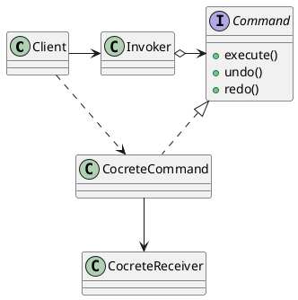

```plantuml
@startuml

class Client {

}

class Invoker {

}

interface Command {
    + execute()
    + undo()
    + redo()
}

class CocreteCommand {

}

Client ..> CocreteCommand
CocreteCommand ..up|> Command

Client -> Invoker
Invoker o-> Command

CocreteCommand --> CocreteReceiver

@enduml
```

## Examples

* java.util.concurrent.Executor

---
