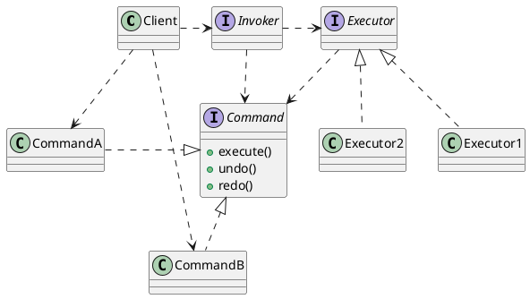

```puml
@startuml

class Client {

}

interface Invoker {

}

interface Command {
    + execute()
    + undo()
    + redo()
}

class CommandA {

}

class CommandB {

}

Client ..> CommandA
Client ..> CommandB
CommandA ..right|> Command
CommandB ..up|> Command

Client .> Invoker
Invoker ..> Command

interface Executor {

}

class Executor1 {

}

class Executor2 {

}

Invoker .> Executor
Executor1 ..up|> Executor
Executor2 ..up|> Executor

Executor ..> Command

@enduml
```
