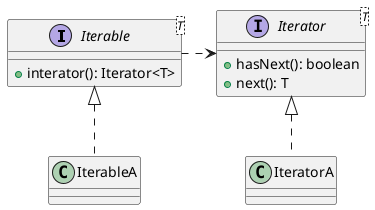

```plantuml
@startuml

interface Iterable<T> {
    + interator(): Iterator<T>
}

interface Iterator<T> {
    + hasNext(): boolean
    + next(): T
}

class IterableA {

}

class IteratorA {

}

Iterable .> Iterator
Iterable <|.. IterableA
Iterator <|.. IteratorA

@enduml
```
