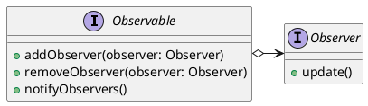

```puml
@startuml

interface Observable {
    + addObserver(observer: Observer)
    + removeObserver(observer: Observer)
    + notifyObservers()
}

interface Observer {
    + update()
}

Observable o-> Observer

@enduml
```
