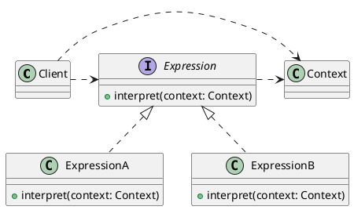

```puml
@startuml

class Client {

}

class Context {

}

interface Expression {
    + interpret(context: Context)
}

class ExpressionA {
    + interpret(context: Context)
}

class ExpressionB {
    + interpret(context: Context)
}

Client .> Context
Client .> Expression
Expression .> Context
Expression <|.. ExpressionA
Expression <|.. ExpressionB

@enduml
```
