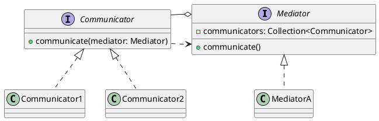

```puml
@startuml

interface Mediator {
    - communicators: Collection<Communicator>
    + communicate()
}

interface Communicator {
    + communicate(mediator: Mediator)
}

class MediatorA {

}

class Communicator1 {

}

class Communicator2 {
    
}

Communicator .> Mediator
Communicator -o Mediator
Communicator <|.. Communicator1
Communicator <|.. Communicator2

Mediator <|.. MediatorA

@enduml
```
