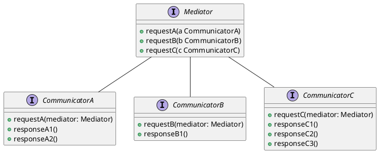

```puml
@startuml

interface Mediator {
    + requestA(a CommunicatorA)
    + requestB(b CommunicatorB)
    + requestC(c CommunicatorC)
}

interface CommunicatorA {
    + requestA(mediator: Mediator)
    + responseA1()
    + responseA2()
}

interface CommunicatorB {
    + requestB(mediator: Mediator)
    + responseB1()
}

interface CommunicatorC {
    + requestC(mediator: Mediator)
    + responseC1()
    + responseC2()
    + responseC3()
}

Mediator -- CommunicatorA
Mediator -- CommunicatorB
Mediator -- CommunicatorC

@enduml
```
