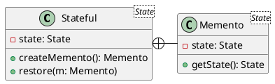

```puml
@startuml

class Stateful <State> {
    - state: State
    + createMemento(): Memento
    + restore(m: Memento)
}

class Memento <State> {
    - state: State
    + getState(): State
}

Stateful +- Memento

@enduml
```
