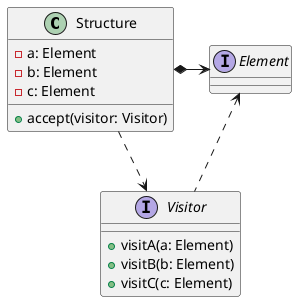

```plantuml
@startuml

class Structure {
    - a: Element
    - b: Element
    - c: Element
    + accept(visitor: Visitor)
}

interface Element {
}

interface Visitor {
    + visitA(a: Element)
    + visitB(b: Element)
    + visitC(c: Element)
}

Structure *-> Element
Structure .> Visitor
Visitor ..up> Element

@enduml
```

## Intent

* Seperate an algorithm from a structure on which it operates.
    * Add new oprations without modifying the structure.

## Principles

* Open-closed Principle

---
