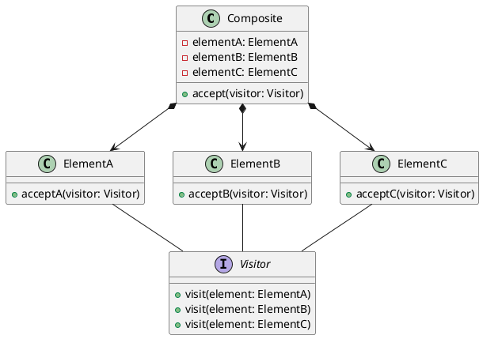

```puml
@startuml

class Composite {
    - elementA: ElementA
    - elementB: ElementB
    - elementC: ElementC
    + accept(visitor: Visitor)
}

class ElementA {
    + acceptA(visitor: Visitor)
}

class ElementB {
    + acceptB(visitor: Visitor)
}

class ElementC {
    + acceptC(visitor: Visitor)
}

interface Visitor {
    + visit(element: ElementA)
    + visit(element: ElementB)
    + visit(element: ElementC)
}

Composite *--> ElementA
Composite *--> ElementB
Composite *--> ElementC
ElementA -- Visitor
ElementB -- Visitor
ElementC -- Visitor

@enduml
```
