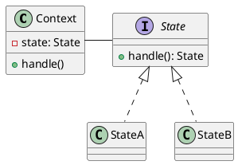

```puml
@startuml

class Context {
    - state: State
    + handle()
}

interface State {
    + handle(): State
}

class StateA {

}

class StateB {

}

Context - State
State <|.. StateA
State <|.. StateB

@enduml
```