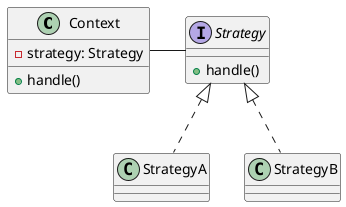

```puml
@startuml

class Context {
    - strategy: Strategy
    + handle()
}

interface Strategy {
    + handle()
}

class StrategyA {

}

class StrategyB {
    
}

Context - Strategy
Strategy <|.. StrategyA
Strategy <|.. StrategyB

@enduml
```