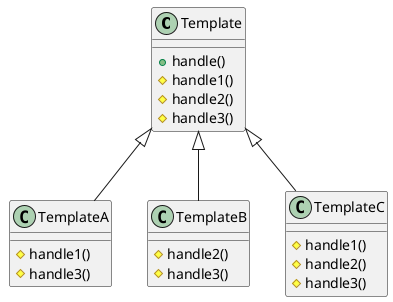

```plantuml
@startuml

class Template {
    + handle()
    # handle1()
    # handle2()
    # handle3()
}

class TemplateA {
    # handle1()
    # handle3()
}

class TemplateB {
    # handle2()
    # handle3()
}

class TemplateC {
    # handle1()
    # handle2()
    # handle3()
}

Template <|-- TemplateA
Template <|-- TemplateB
Template <|-- TemplateC

@enduml
```
