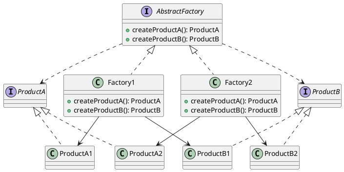

```puml
@startuml

interface AbstractFactory {
    + createProductA(): ProductA
    + createProductB(): ProductB
}

class Factory1 {
    + createProductA(): ProductA
    + createProductB(): ProductB
}

class Factory2 {
    + createProductA(): ProductA
    + createProductB(): ProductB
}

interface ProductA {

}

interface ProductB {

}

class ProductA1 {

}

class ProductA2 {
    
}

class ProductB1 {
    
}

class ProductB1 {
    
}

ProductB <|.. ProductB1
ProductB <|.. ProductB2
ProductA <|.. ProductA1
ProductA <|.. ProductA2

AbstractFactory ..> ProductA
AbstractFactory ..> ProductB

AbstractFactory <|.. Factory1
AbstractFactory <|.. Factory2

Factory1 --> ProductA1
Factory1 --> ProductB1
Factory2 --> ProductA2
Factory2 --> ProductB2

@enduml
```
