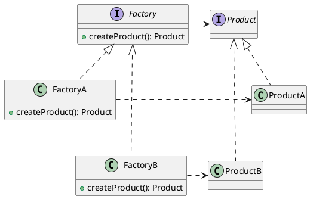

```puml
@startuml

interface Factory {
    + createProduct(): Product
}

interface Product {

}

class ProductA {

}

class ProductB {
    
}

ProductA ..up|> Product
ProductB ...up|> Product

class FactoryA {
    + createProduct(): Product
}

class FactoryB {
    + createProduct(): Product
}

Factory -> Product
Factory <|.. FactoryA
Factory <|... FactoryB

FactoryA .> ProductA
FactoryB .> ProductB

@enduml
```
