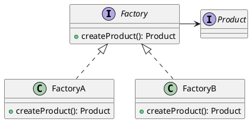

```puml
@startuml

interface Factory {
    + createProduct(): Product
}

interface Product {

}

class FactoryA {
    + createProduct(): Product
}

class FactoryB {
    + createProduct(): Product
}

Factory -> Product
Factory <|.. FactoryA
Factory <|.. FactoryB

@enduml
```
