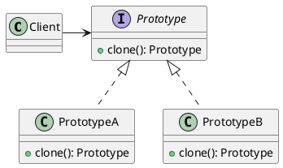

```plantuml
@startuml

class Client {

}

interface Prototype {
    + clone(): Prototype
}

class PrototypeA {
    + clone(): Prototype
}

class PrototypeB {
    + clone(): Prototype
}

Client -> Prototype
Prototype <|.. PrototypeA
Prototype <|.. PrototypeB

@enduml
```
