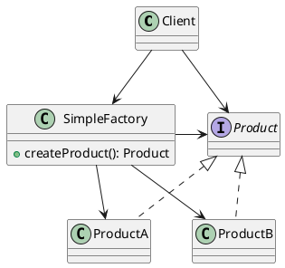

```puml
@startuml

class Client {

}

class SimpleFactory {
+ createProduct(): Product
}

interface Product {

}

class ProductA {

}

class ProductB {
    
}

Client --> SimpleFactory
Client --> Product
SimpleFactory -> Product
SimpleFactory --> ProductA
SimpleFactory --> ProductB
Product <|.. ProductA
Product <|.. ProductB

@enduml
```
