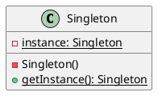
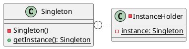
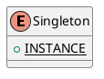

# Singleton

## Solution

* Simple

* Inner Class

* Enumeration

## Issues

* Thread Safe
    * volatile
    * synchronized

* Uniqueness
    * Class Load
    * Clone
    * Reflect
    * Deserialize

---
