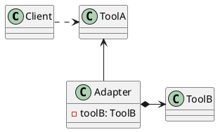

```plantuml
@startuml

class Client {

}

class ToolA {

}

class ToolB {

}

class Adapter {
    - toolB: ToolB
}

Client .> ToolA
Adapter --up> ToolA
Adapter *-> ToolB

@enduml
```

## Examples

* java.io
    * InputStream
    * OutputStream

---
