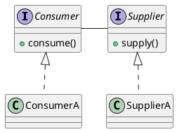

```puml
@startuml

interface Consumer {
    + consume()
}

interface Supplier {
    + supply()
}

class ConsumerA {

}

class SupplierA {

}

Consumer - Supplier
ConsumerA ..up|> Consumer
SupplierA ..up|> Supplier

@enduml
```
