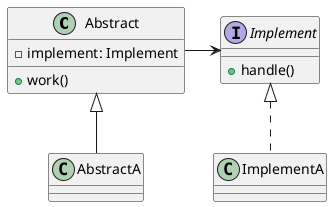

```puml
@startuml

class Abstract {
    - implement: Implement
    + work()
}

interface Implement {
    + handle()
}

class AbstractA {

}

class ImplementA {

}

Abstract -> Implement
AbstractA --up|> Abstract
ImplementA ..up|> Implement

@enduml
```
