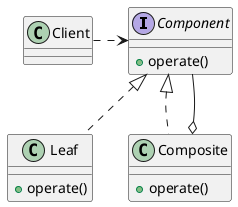

```plantuml
@startuml

interface Component {
    + operate()
}

class Leaf {
    + operate()
}

class Composite {
    + operate()
}

Leaf ..up|> Component
Composite ..up|> Component
Composite o-- Component

class Client {

}

Client .> Component

@enduml
```
