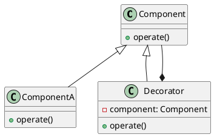

```puml
@startuml

class Component {
    + operate()
}

class ComponentA {
    + operate()
}

class Decorator {
    - component: Component
    + operate()
}

ComponentA --up|> Component
Decorator --up|> Component
Decorator *-- Component

@enduml
```
