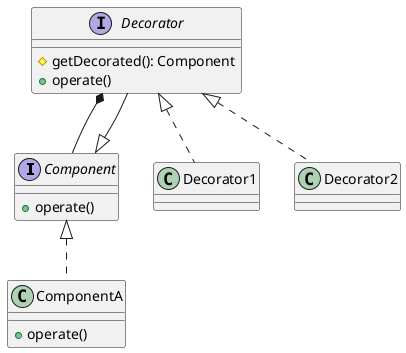

```puml
@startuml

interface Component {
    + operate()
}

class ComponentA {
    + operate()
}

interface Decorator {
    # getDecorated(): Component
    + operate()
}

ComponentA ..up|> Component
Decorator --up|> Component
Decorator *-- Component

class Decorator1 {

}

class Decorator2 {
    
}

Decorator1 ..up|> Decorator
Decorator2 ..up|> Decorator

@enduml
```
