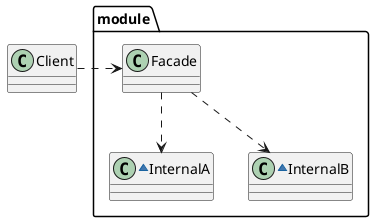

```plantuml
@startuml

class Client {

}

namespace module {

    class Facade {

    }

    ~class InternalA {

    }

    ~class InternalB {

    }

    Facade ..> InternalA
    Facade ..> InternalB
}

Client .> module.Facade

@enduml
```
