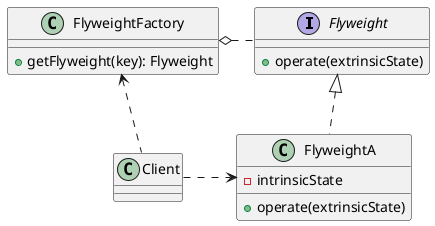

```plantuml
@startuml

interface Flyweight {
    + operate(extrinsicState)
}

class FlyweightA {
    - intrinsicState
    + operate(extrinsicState)
}

FlyweightA ..up|> Flyweight

class FlyweightFactory {
    + getFlyweight(key): Flyweight
}

FlyweightFactory o. Flyweight
Client ..up> FlyweightFactory
Client .> FlyweightA

@enduml
```
