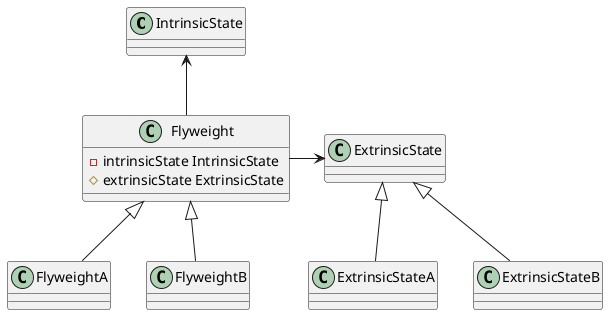

```puml
@startuml

class IntrinsicState {

}

class ExtrinsicState {

}

class Flyweight {
    - intrinsicState IntrinsicState
    # extrinsicState ExtrinsicState
}

class FlyweightA {
}

class FlyweightB {
}

class ExtrinsicStateA {

}

class ExtrinsicStateB {

}

Flyweight --up> IntrinsicState
Flyweight -> ExtrinsicState

ExtrinsicStateA --up|> ExtrinsicState
ExtrinsicStateB --up|> ExtrinsicState

FlyweightA --up|> Flyweight
FlyweightB --up|> Flyweight

@enduml
```
